## 前言
所有实验前务必检查下当前路由器/交换机等做了哪些配置（show run）

show run 查看后在对应的配置前加个no  
default interface range g0/1-6 #清除端口配置  
no interface vlan 10  
所有操作都可以no shutdown确保生效

## 跨交换机相同VLAN通信+端口聚合
两个二层交换机
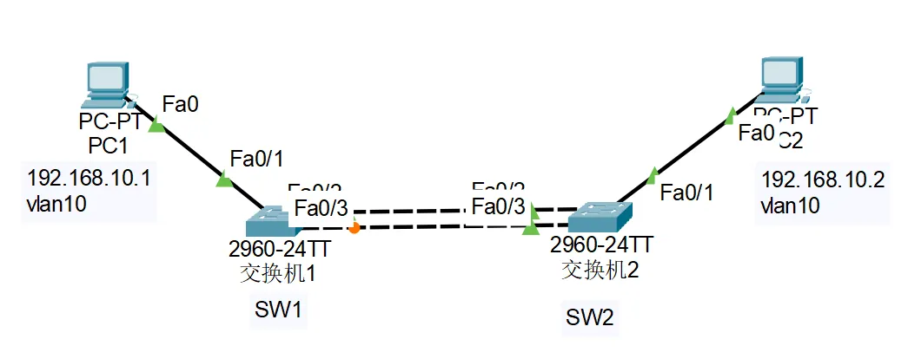
以`pc1`ping`pc2`为验证
交换机`sw1`、`sw2`都要做以下操作（注意端口是否如图所示)：

```shell
实验室交换机连接可能需要密码(en 14   密码stu)
Switch>en
Switch#config
Switch(config)#hostname Sw1 #可以先改个名，便于区分，以后不再赘述
Sw1(config)#vlan 10
Sw1(config)#vlan 20
Sw1(config)#interface f0/1  #进入1口实验用的是giga(g0/1)，记得换
Sw1(config-if)#switchport access vlan 10
Sw1(config-if)#exit
Sw1(config)#interface f0/2  #进入2口，改为trunk mode
Sw1(config-if)#switchport mode trunk
Sw1(config-if)#exit
Sw1(config)#interface f0/3  #进入3口，改为trunk mode
Sw1(config-if)#switchport mode trunk
Sw1(config-if)#exit
Sw1#show vlan #检查vlan
#端口聚合
Sw1(config)# no spanning-tree    # 关闭生成树，清除下可能影响操作的配置
Sw1(config)# interface range fastEthernet 0/2 - 3
Sw1(config-if-range)# port-group 1 mode active   # 设置端口聚合
Sw1(config-if-range)# no shutdown
Sw1(config-if-range)# end
Sw1# show aggregatePort summary #检查端口聚合状态
```

### 验证：
pc1上执行：ping -t 192.168.10.2

在一台交换机上，断开两端口之一，均能正常通信，ping不会断开。

```shell
Sw1# configure terminal
Sw1(config)# interface f0/2 
Sw1(config-if)# shutdown       # 断开 0/2
Sw1(config-if)# no shutdown    # 恢复端口，以便尝试断开0/3
Sw1(config-if)# end
Sw1# confgure terminal
Sw1(config)# interface f0/3
Sw1(config-if)# shutdown       # 断开 0/3
```

## 跨交换机相同VLAN通信+RSTP
两个二层交换机

拓扑图和创建vlan参考端口聚合

两台交换机都要做：

```shell
#如果做了端口聚合需要把端口聚合取消掉
Sw1(config)# interface f0/2 
Sw1(config)# no port-group 1
Sw1(config)# interface f0/3
Sw1(config)# no port-group 1 #两个端口都要no掉
#正片开始！
Sw1(config)# spanning-tree   // 启动生成树
Sw1(config)# spanning-tree mode rstp   // 设置RSTP模式！
Sw1(config)# end
```

### 验证
在非根交换机中查看生成树状态：

```shell
#先判断是否为非根交换机
Sw1# show spanning-tree
#非根交换机有Root-port关键字
#然后查看对应端口状态
Sw1# show spanning-tree interface gigabitEthernet 0/2
Sw1# show spanning-tree interface gigabitEthernet 0/3
```

## 跨交换机相同VLAN通信+VLAN间路由
一个二层交换机，一个三层交换机

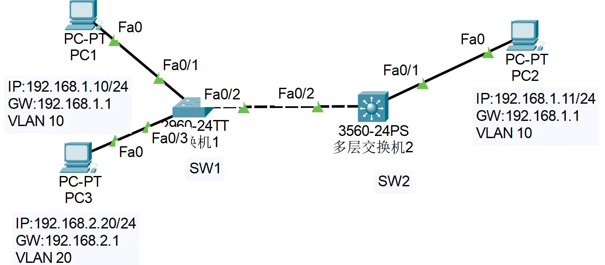
目标是三台主机互相都能ping通

二层交换机配置

```shell
#创建vlan
Sw1(config)#vlan 10
Sw1(config)#vlan 20
Sw1(config)#interface f0/1  
Sw1(config-if)#switchport mode access
Sw1(config-if)#switchport access vlan 10 
Sw1(config-if)#exit
Sw1(config)#interface f0/3  
Sw1(config-if)#switchport mode access
Sw1(config-if)#switchport access vlan 20
Sw1(config-if)#exit
Sw1(config)#interface f0/2  #进入2口，改为trunk mode
Sw1(config-if)#switchport mode trunk
Sw1(config-if)#exit
Sw1#show vlan #检查vlan
```

三层交换机配置

```shell
Sw2(config)#vlan 10
Sw2(config)#vlan 20
Sw2(config)#interface vlan 10
Sw2(config-if-VLAN 10)#ip address 192.168.1.1 255.255.255.0
Sw2(config-if-VLAN 10)#no shutdown
Sw2(config-if-VLAN 10)#exit
Sw2(config)#interface vlan 20
Sw2(config-if-VLAN 20)#ip address 192.168.2.1 255.255.255.0
Sw2(config-if-VLAN 20)#no shutdown
Sw2(config-if-VLAN 20)#exit
Sw2(config)#interface f0/2
Sw2(config-if)#switchport mode trunk
Sw2(config)# ip routing  # 启用路由
```

### 验证：
`pc1`,`pc2`,`pc3`设置好ip和网关后相互之间能ping通

## VLAN间路由+Telnet
一个三层交换机，一个二层交换机

vlan间路由和拓扑图都可参考上面的实验，这里只给出telnet的做法

```shell
#telnet
#给交换机配ip
Sw1(config)#interface vlan 1
Sw1(config-if)#no shutdown
Sw1(config-if)#ip address 192.168.10.4 255.255.255.0
Sw1(config-if)#end
#配置进入特权模式密码
Sw1(config)#enable password 123456
#telnet远程登录
Sw1(config)#line vty 0 4
Sw1(config-line)#password abc123 #远程登录密码
Sw1(config-line)#login
```

### 验证
三台主机互相之间能ping通

`pc1`命令行执行`telnet 192.168.10.4`连接交换机1

可用`show run`查看交换机ip是否配置成功

## 单臂路由+Telnet
一个路由器，一个二层交换机  
telnet参考前面


交换机配置

```shell
Sw1(config)#vlan 10
Sw1(config)#vlan 20
Sw1(config)#interface f0/2 
Sw1(config-if)#switchport mode access
Sw1(config-if)#switchport access vlan 10 
Sw1(config-if)#exit
Sw1(config)#interface f0/3  
Sw1(config-if)#switchport mode access
Sw1(config-if)#switchport access vlan 20
Sw1(config-if)#exit
Sw1(config)#interface f0/1
Sw1(config-if)#switchport mode trunk #连接路由器的端口设为Trunk模式
```
路由器配置
```shell
R1(config)#interface g0/0 #进入连接交换机的端口
R1(config-if)#no shutdown
R1(config-if)#exit 
R1(config)# interface fastethernet 0/0.10 #创建子接口
R1(config-subif)#description vlan 10 #描述子接口
R1(config-subif)#encapsulation dot1Q 10      #关联VLAN 10
R1(config-subif)#ip address 192.168.10.1 255.255.255.0
R1(config-subif)#no shutdown
R1(config-subif)#exit
#对vlan20做相似操作
R1(config)# interface fastethernet 0/0.20 
R1(config-subif)#description vlan 20 
R1(config-subif)#encapsulation dot1Q 20     
R1(config-subif)#ip address 192.168.20.1 255.255.255.0
R1(config-subif)#no shutdown
R1(config-subif)#exit
```

### 验证
`pc1`ping`pc2`,注意要配置网关(192.168.10.1 192.168.20.1)

show ip interface查看子接口

## 一个局域网内部两个不同VLAN的主机均可访问另一个VLAN中的服务器
两个路由器  
web服务配置：找到IIS右键属性更改配置(图形化界面操作得靠自己！）然后应用  
静态NAPT和动态NAPT做一个就可以了  
**可不用路由器。**

**这里是用交换机的做法**


`sw1`配置

```shell
# 进入特权模式
Ruijie> enable
Ruijie# configure terminal
Ruijie(config)# hostname SW1
# 创建 VLAN 10 和 VLAN 20
SW1(config)# vlan 10
SW1(config-vlan)# exit
SW1(config)# vlan 20
SW1(config-vlan)# exit
# 配置连接 pc1 的端口
SW1(config)# interface f0/1
SW1(config-if)# switchport mode access
SW1(config-if)# switchport access vlan 10
SW1(config-if)# exit
# 配置连接 SERVER 1 的端口
SW1(config)# interface f0/2
SW1(config-if)# switchport mode access
SW1(config-if)# switchport access vlan 20
SW1(config-if)# exit
# 配置连接 SW2 的上行端口为 Trunk 模式
SW1(config)# interface f0/2
SW1(config-if)# switchport mode trunk
SW1(config-if)# exit
```

`**sw2**`**配置**

```shell
# 进入全局配置模式
Ruijie> enable
Ruijie# configure terminal
Ruijie(config)# hostname SW2
# 开启三层交换机的路由功能
SW2(config)# ip routing
# 创建 VLAN 10、VLAN 20 和 VLAN 30
SW2(config)# vlan 10
SW2(config-vlan)# exit
SW2(config)# vlan 20
SW2(config-vlan)# exit
SW2(config)# vlan 30
SW2(config-vlan)# exit
# 创建 VLAN 接口(SVI)并配置IP地址，作为各VLAN的网关
SW2(config)# interface Vlan 10
SW2(config-if-Vlan 10)# ip address 192.168.1.1 255.255.255.0
SW2(config-if-Vlan 10)# no shutdown
SW2(config-if-Vlan 10)# exit
SW2(config)# interface Vlan 20
SW2(config-if-Vlan 20)# ip address 192.168.2.1 255.255.255.0
SW2(config-if-Vlan 20)# no shutdown
SW2(config-if-Vlan 20)# exit
SW2(config)# interface Vlan 30
SW2(config-if-Vlan 30)# ip address 192.168.3.1 255.255.255.0
SW2(config-if-Vlan 30)# no shutdown
SW2(config-if-Vlan 30)# exit
# 配置连接 SW1 的端口为 Trunk 模式
SW2(config)# interface f0/2
SW2(config-if)# switchport mode trunk
SW2(config-if)# exit
# 配置连接 SERVER 2 的端口为 Access 模式并划入 VLAN 30
SW2(config)# interface f0/3
SW2(config-if)# switchport mode access
SW2(config-if)# switchport access vlan 30
SW2(config-if)# exit
```
验证
任意主机之间ping通


静态NAPT(`xp1`访问`serve1`[http://200.1.8.9](http://200.1.8.9))

`R1`配置

```shell
R1(config)#interface g0/1 
R1(config-if)#ip address 192.168.1.1 255.255.255.0
R1(config-if)#ip nat inside
R1(config-if)#no shutdown
R1(config-if)#exit
R1(config)#interface g0/0 #进入连接R2的端口
R1(config-if)#ip address 200.1.8.7 255.255.255.0
R1(config-if)#ip nat outside
R1(config-if)#no shutdown
R1(config-if)#exit
R1(config)#ip route 0.0.0.0 0.0.0.0 200.1.8.8 #默认路由到R2
R1(config)#ip nat inside source static tcp 192.168.1.2 80 200.1.8.9 80 #静态NAPT
```

`R2`配置

```shell
R2(config)#interface g0/1 
R2(config-if)#ip address 63.19.6.2 255.0.0.0
R2(config-if)#no shutdown
R2(config-if)#exit
R2(config)#interface g0/0 #进入连接R1的端口
R2(config-if)#ip address 200.1.8.8 255.255.255.0
R2(config-if)#no shutdown
R2(config-if)#exit
R2(config)#ip route 0.0.0.0 0.0.0.0 200.1.8.7 #默认路由到R1
```

show ip route查看路由状态

动态NAPT(`XP1`访问`server1`[http://192.168.1.2](http://192.168.1.2))

承接上面的配置,在`R1`上配置

```shell
R1(config)#no ip nat inside source static tcp 192.168.1.2 80 200.1.8.9 80 #清除下
R1(config)#access-list 10 permit 192.168.1.0 0.0.0.255 #反掩码
R1(config)#ip nat pool abc 200.1.8.7 200.1.8.7 netmask 255.255.255.0
R1(config)#ip nat inside source list 10 pool abc overload
```

### 验证
静态NAPT(`xp1`访问`serve1`[http://200.1.8.9](http://200.1.8.9))

动态NAPT(`XP1`访问`server1`[http://192.168.1.2](http://192.168.1.2))

## DHCP中继实现地址自动分配
一个三层交换机

要实现pc1和pc2使用dhcp自动分配地址

注意server和PC1都在vlan10中


配下vlan

```shell
Sw(config)#vlan 10
Sw(config)#vlan 20
Sw(config)#interface f0/1 #DHCPsever
Sw(config-if)#switchport mode access
Sw(config-if)#switchport access vlan 10 
Sw(config-if)#exit
Sw(config)#interface f0/2 #pc1 
Sw(config-if)#switchport mode access
Sw(config-if)#switchport access vlan 10 
Sw(config-if)#exit
Sw(config)#interface f0/3  #pc2
Sw(config-if)#switchport mode access
Sw(config-if)#switchport access vlan 20
Sw(config-if)#exit
```

给vlan配置ip(**若存在dhcp服务器,也就是server**）

```shell
Sw(config)#interface vlan 10
Sw(config-if)#ip address 192.168.1.1 255.255.255.0
Sw(config-if)#ip helper-address 192.168.1.254 #ip为dhcp服务器
Sw(config-if)#exit
Sw(config)#interface vlan 20
Sw(config-if)#ip address 192.168.2.1 255.255.255.0
Sw(config-if)#ip helper-address 192.168.1.254 
Sw(config-if)#exit
Sw(config)#service dhcp
Sw#show ip interface vlan 20
```

接下来就要去`server`上操作(图形化界面操作得靠自己！）

**新建两个作用域（vlan10，vlan20）**

点击运行-管理工具-DHCP-操作-新建作用域-

ip范围设置为192.168.1.2-192.168.1.50（这是vlan10的配置，vlan20为192.168.2.2-192.168.1.50-

网关设置为dhcp服务器的ip地址-添加后再点下一步-DNS地址随便写(不用写也是可以的）-添加后再点下一步-然后一直下一步，直到完成

然后其他操作相同，为vlan 20 也配置地址池

`pc1`和`pc2`选自动分配ip

### 验证
到这里就做完了，验证方式就是在`pc1`和`pc2`上`ipconfig`一下，检查是否自动获取到ip

下面是另一种做法，但未经验证

**如果没有dhcp服务器则在交换机上操作（没做过）**

配置DHCP服务

```shell
Sw(config)#service dhcp
Sw(config)#interface vlan 10
Sw(config-if)#ip address 192.168.1.1 255.255.255.0
Sw(config-if)#exit
Sw(config)#interface vlan 20
Sw(config-if)#ip address 192.168.2.1 255.255.255.0
Sw(config-if)#exit
Sw(config)#ip dhcp pool vlan10
Sw(dhcp-config)#network 192.168.1.2 255.255.255.0       //分配主机IP地址和子网掩码
Sw(dhcp-config)#dns-server 192.168.10.1         //192.168.10.1 为DNS地址（随便写）
Sw(dhcp-config)#default-router 192.168.1.1          //VLAN10的网关地址
Sw(dhcp-config)#exit
Sw(config)#ip dhcp pool vlan20
Sw(dhcp-config)#network 192.168.2.2 255.255.255.0         
Sw(dhcp-config)#dns-server 192.168.20.1          
Sw(dhcp-config)#default-router 192.168.2.1             
Sw(dhcp-config)#end
```

注意这两种情况应该是任选其一即可，看具体要求

## 跨交换机相同VLAN通信+Telnet
没啥好说的，看前面对应的内容

## 综合设计
任务要求：
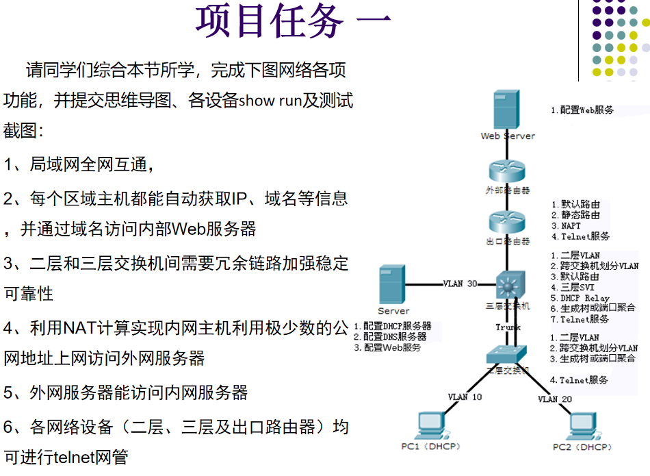
拓扑图
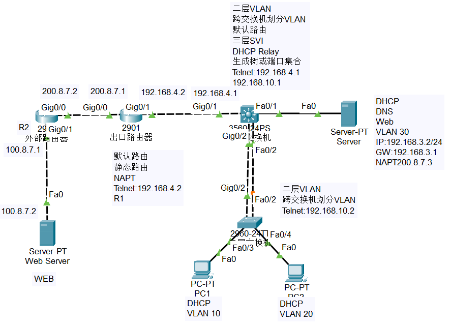
`sw2`配置
```shell
Sw2(config)# spanning-tree mode rapid-pvst
Sw2(config)#interface f0/3  
Sw2(config-if)#switchport access vlan 10
Sw2(config-if)#exit
Sw2(config)#interface f0/4  
Sw2(config-if)#switchport access vlan 20
Sw2(config-if)#exit
Sw2(config)#interface f0/2
Sw2(config-if)#switchport mode trunk
Sw2(config-if)#exit
Sw2(config)#interface g0/2
Sw2(config-if)#switchport mode trunk
Sw2(config-if)#exit
#telnet
Sw2(config)#interface vlan 1
Sw2(config-if)#ip address 192.168.10.2 255.255.255.0
Sw2(config-if)#exit
Sw2(config)#ip default-gateway 192.168.4.1
Sw2(config)#enable password 123456
Sw2(config)#line vty 0 4
Sw2(config-line)#password abc123 #远程登录密码
Sw2(config-line)#login
```
`sw3`配置
```shell
Sw3(config)#spanning-tree mode rapid-pvst 
Sw3(config)#ip routing
Sw3(config)#ip route 0.0.0.0 192.168.4.2
Sw3(config)#interface f0/1
Sw3(config-if)#switchport access vlan 30
Sw3(config-if)#exit
Sw3(config)#interface g0/1
Sw3(config-if)#no switchport
Sw3(config-if)#ip address 192.168.4.1 255.255.255.0
Sw3(config-if)#exit
Sw3(config)#interface vlan 10
Sw3(config-if)#ip address 192.168.1.1 255.255.255.0
Sw3(config-if)#ip helper-address 192.168.3.2
Sw3(config-if)#exit
Sw3(config)#interface vlan 20
Sw3(config-if)#ip address 192.168.2.1 255.255.255.0
Sw3(config-if)#ip helper-address 192.168.3.2
Sw3(config-if)#exit
Sw3(config)#interface vlan 30
Sw3(config-if)#ip address 192.168.3.1 255.255.255.0
Sw3(config-if)#exit
#telnet
Sw3(config)#interface vlan 1
Sw3(config-if)#ip address 192.168.10.1 255.255.255.0
Sw3(config)#enable password 123456
Sw3(config)#line vty 0 4
Sw3(config-line)#password abc123 
Sw3(config-line)#login
```
`R1`配置
```shell
R1(config)#interface g0/0
R1(config-if)#ip address 200.8.7.1 255.0.0.0
R1(config-if)#ip nat outside
R1(config-if)#exit
R1(config)#interface g0/1
R1(config-if)#ip address 192.168.4.2 255.255.255.0
R1(config-if)#ip nat inside
R1(config-if)#exit
R1(config)#ip nat pool vlan10 200.8.7.10 200.8.7.10 netmask 255.0.0.0
R1(config)#ip nat pool vlan20 200.8.7.20 200.8.7.20 netmask 255.0.0.0
R1(config)#ip nat pool inside source static tcp 192.168.3.2 80 200.8.7.3 80
R1(config)#ip route 0.0.0.0 0.0.0.0 200.8.7.2
R1(config)#ip route 192.168.1.0 255.255.255.0 192.168.4.1
R1(config)#ip route 192.168.2.0 255.255.255.0 192.168.4.1
R1(config)#ip route 192.168.3.0 255.255.255.0 192.168.4.1
R1(config)#access-list 10 perimit 192.168.1.0 0.0.0.255
R1(config)#access-list 20 perimit 192.168.2.0 0.0.0.255
R1(config)#enable password 123456
R1(config)#line vty 0 4
R1(config-line)#password abc123 
R1(config-line)#login
#不需要给vlan1加ip！
```
`R2`配置
```shell
R2(config)#interface g0/0
R2(config-if)#ip address 200.8.7.2 255.0.0.0
R2(config-if)#exit
R2(config)#interface g0/1
R2(config-if)#ip address 100.8.7.1 255.0.0.0
R2(config-if)#exit
R2(config)#ip route 0.0.0.0 0.0.0.0 200.8.7.1
```
服务器相关配置参照相关图片
验证
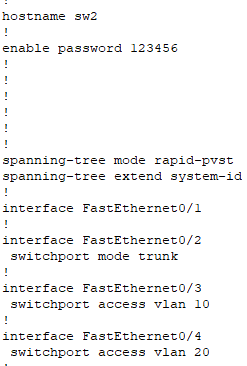
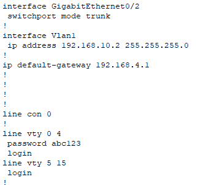
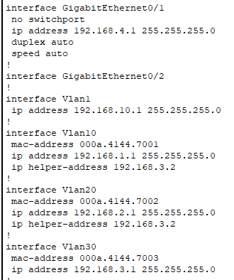
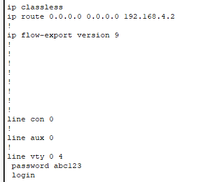
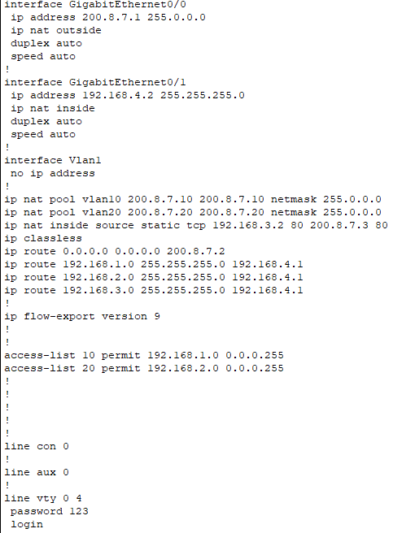
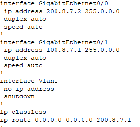
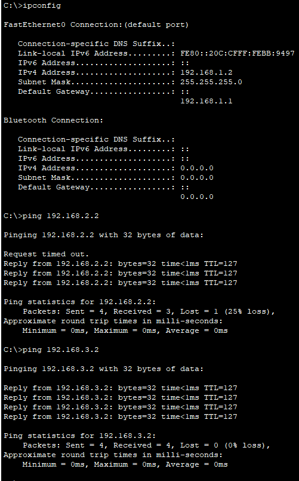
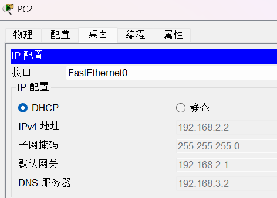
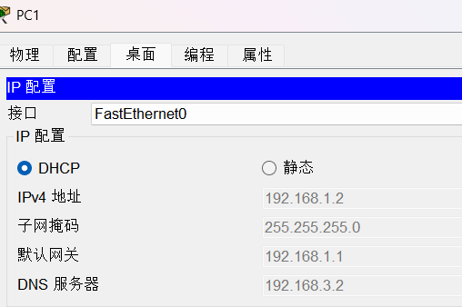
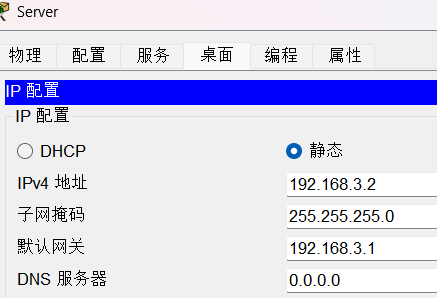
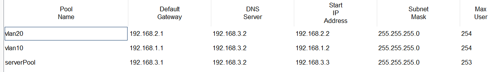
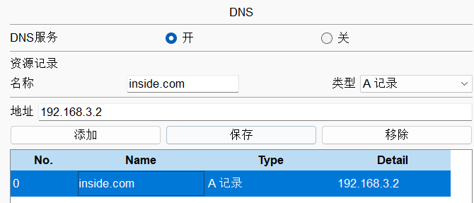
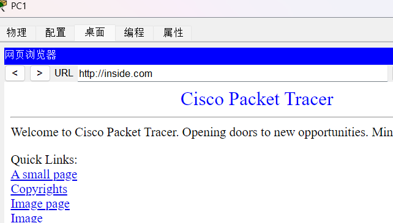
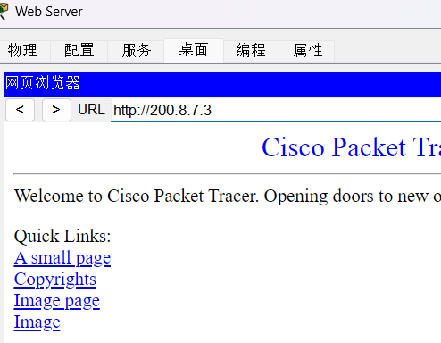
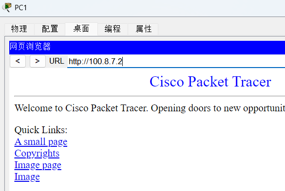
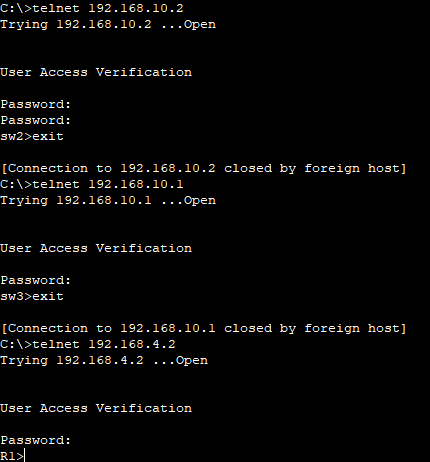
