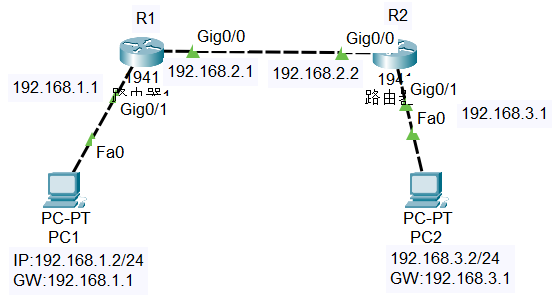
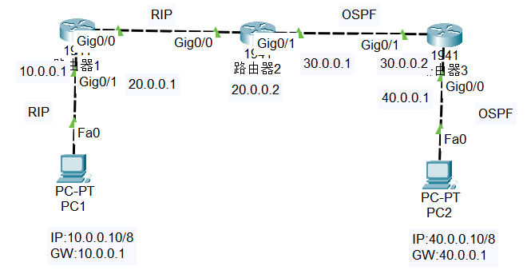
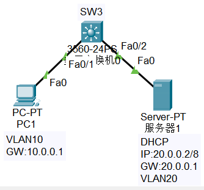

## 前言
所有实验前务必检查下当前路由器/交换机等做了哪些配置（show run）
还要检查下对应端口是否为up(no shutdown)
show run 查看后在对应的配置前加个no  
default interface range g0/1-6 #清除端口配置  
no interface vlan 10  
所有操作都可以no shutdown确保生效
## 静态路由+TELNET

`R1`配置
```shell
R1(config)#interface g0/0
R1(config-if)#ip address 192.168.2.1 255.255.255.0
R1(config-if)#exit
R1(config)#interface g0/1
R1(config-if)#ip address 192.168.1.1 255.255.255.0
R1(config-if)#exit
R1(config)#ip route 192.168.3.0 255.2555.255.0 192.168.2.2#转发给R2
#telnet
R1(config)#enable password 123456
Sw1(config)#line vty 0 4
Sw1(config-line)#password abc123 #远程登录密码
Sw1(config-line)#login
```
`R2`配置
```shell
R2(config)#interface g0/0
R2(config-if)#ip address 192.168.2.2 255.255.255.0
R2(config-if)#exit
R2(config)#interface g0/1
R2(config-if)#ip address 192.168.3.1 255.255.255.0
R2(config-if)#exit
R2(config)#ip route 192.168.1.0 255.2555.255.0 192.168.2.1#转发给R1
```
### 验证
`show ip route`查看路由
给两个pc配上对应的ip后能ping通即可
telnet 192.168.1.1能连上R1即可
## OSPF单区域配置+TELNET
参考上面的拓扑图
TELNET参考上面
`R1`配置
```shell
R1(config)#interface g0/0
R1(config-if)#ip address 192.168.2.1 255.255.255.0
R1(config-if)#exit
R1(config)#interface g0/1
R1(config-if)#ip address 192.168.1.1 255.255.255.0
R1(config-if)#exit
R1(config)#ip route 192.168.3.0 255.2555.255.0 192.168.2.2#转发给R2
#ospf
R1(config)#router ospf 100
R1(config-router)#network 192.168.1.0 0.255.255.255 area 1#反掩码
R1(config-router)#network 192.168.2.0 0.255.255.255 area 2
```
`R2`配置
```shell
R2(config)#interface g0/0
R2(config-if)#ip address 192.168.2.2 255.255.255.0
R2(config-if)#exit
R2(config)#interface g0/1
R2(config-if)#ip address 192.168.3.1 255.255.255.0
R2(config-if)#exit
R2(config)#router ospf 100
R2(config-router)#network 192.168.3.0 0.255.255.255 area 3
R2(config-router)#network 192.168.2.0 0.255.255.255 area 2
```
### 验证
`show ip route`查看路由
给两个pc配上对应的ip后能ping通即可
## 路由重发布

`R1`配置
```shell
R1(config)#interface g0/0
R1(config-if)#no shutdown
R1(config-if)#ip address 20.0.0.1 255.0.0.0
R1(config-if)#exit
R1(config)#interface g0/1
R1(config-if)#no shutdown
R1(config-if)#ip address 10.0.0.1 255.0.0.0
R1(config-if)#exit
R1(config)#route rip
R1(config-router)#version 2
R1(config-router)#network 10.0.0.0 255.0.0.0
R1(config-router)#network 20.0.0.0 255.0.0.0
R1(config-router)#exit
```
`R2`配置
```shell
R2(config)#interface g0/0
R2(config-if)#no shutdown
R2(config-if)#ip address 20.0.0.2 255.0.0.0
R2(config-if)#exit
R2(config)#interface g0/1
R2(config-if)#no shutdown
R2(config-if)#ip address 30.0.0.1 255.0.0.0
R2(config-if)#exit
R2(config)#route rip
R2(config-router)#version 2
R2(config-router)#network 20.0.0.0 255.0.0.0
R2(config-router)#redistribute ospf 10 metric 5
R2(config-router)#exit
R2(config)#router ospf 10
R2(config-router)#network 30.0.0.0 0.255.255.255 area 1
R2(config-router)#redistribute rip subnets
R2(config-router)#exit
```
`R3`配置
```shell
R3(config)#interface g0/0
R3(config-if)#no shutdown
R3(config-if)#ip address 40.0.0.1 255.0.0.0
R3(config-if)#exit
R3(config)#interface g0/1
R3(config-if)#no shutdown
R3(config-if)#ip address 30.0.0.2 255.0.0.0
R3(config-if)#exit
R3(config)#router ospf 10
R3(config-router)#network 30.0.0.0 0.255.255.255 area 1
R3(config-router)#network 40.0.0.0 0.255.255.255 area 1
R3(config-router)#exit
```
### 验证
`show ip route`查看路由
给两个pc配上对应的ip后能ping通即可
## DHCP
路由器或三层交换机（一个三层交换机+一个PC+一台服务器server）实现对不同网段中PC的地址自动分配，并能访问固定地址的服务器server上的WEB网页

`sw3`配置
```shell
Sw(config)#interface f0/1
Sw(config-if)#switchport access vlan 10
Sw(config-if)#exit
Sw(config)#interface f0/2
Sw(config-if)#switchport access vlan 20
Sw(config-if)#exit
Sw(config)#interface vlan 10
Sw(config-if)#ip address 10.0.0.1 255.0.0.0
Sw(config-if)#ip helper-address 20.0.0.2 #ip为dhcp服务器的ip
Sw(config-if)#exit
Sw(config)#interface vlan 20
Sw(config-if)#ip address 20.0.0.1 255.0.0.0
Sw(config-if)#exit
Sw(config)#service dhcp
Sw(config)#ip routing
```
再开启dhcp服务和web服务进行验证
### 验证
`show ip interface vlan 10`验证 
pc1访问http://20.0.0.2
## RIP+TELNET
拓扑图参考静态路由的拓扑图
`R1`配置
```shell
R1(config)#interface g0/0
R1(config-if)#no shutdown
R1(config-if)#ip address 192.168.2.1 255.255.255.0
R1(config-if)#exit
R1(config)#interface g0/1
R1(config-if)#no shutdown
R1(config-if)#ip address 192.168.1.2 255.255.255.0
R1(config-if)#exit
R1(config)#route rip
R1(config-router)#version 2
R1(config-router)#network 192.168.1.0 255.255.255.0
R1(config-router)#network 192.168.2.0 255.255.255.0
R1(config-router)#exit
```
`R2`配置
```shell
R1(config)#interface g0/0
R1(config-if)#no shutdown
R1(config-if)#ip address 192.168.2.2 255.255.255.0
R1(config-if)#exit
R1(config)#interface g0/1
R1(config-if)#no shutdown
R1(config-if)#ip address 192.168.3.2 255.255.255.0
R1(config-if)#exit
R1(config)#route rip
R1(config-router)#version 2
R1(config-router)#network 192.168.2.0 255.255.255.0
R1(config-router)#network 192.168.3.0 255.255.255.0
R1(config-router)#exit
```
### 验证
`show ip route`查看路由
给两个pc配上对应的ip后能ping通即可
## 标准的ACL

## 利用动态NAPT实现局域网访问互联网

## 利用NAT实现外网主机访问内网服务器

