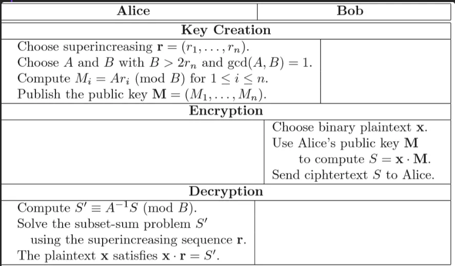

## 背包问题
假定一个背包可以承重 $ S $ ，现在有 $ n $ 个物品，其重量分别为 $ a1,a2…an $ ，试问装哪些物品可以 **恰好** 使得背包被装满，而且每个物品 **最多被装一次** 。转化成数学式子即是  

$ x1a1+x2a2+⋯+xnan=S $

其中 $ xi∈0,1 $

显然我们必须枚举所有的 $ n $ 个物品的组合才能解决这个问题，而复杂度也就是 $ 2n $ ，这也就是背包加密的妙处所在。

在谈加密过程之前，先了解一下超递增序列

## 超递增序列
$ {a1,a2,…,an} $ 是超递增序列，指的是 $ ai>a1+a2+⋯+ai−1 $ ，即第 $ i $ 个数大于前面 $ i−1 $ 个数之和，也即 $ ai>2ai−1 $

当明文和超递增序列依次相乘再求和时  

$ x1a1+x2a2+⋯+xnan=S,xi={0,1},ai>0 $

**我们可以通过依次比较S与序列中最大的元素大小关系，来确定该元素性质**

例如，当 $ S>an $ 时，说明 $ xn=1 $

接下来，令 $ S=S−an $ ，再比较 $ S $ 与 $ rn−1 $

通过 $ n $ 次比较，我们即可获得所有 $ x $ 的值

背包加密算法流程如下:

## Encryption
1. 明文

明文字符串转成二进制，生成明文序列 $ x=(x1,x2,…,xn),xi∈(0,1) $

1. 私钥

生成一个超递增序列 $ r=(r1,r2,…,rn) $ 作为私钥序列

1. 公钥
+ 生成模数 $ B $ ，满足

$ B>∑i=1nri $

+ 即满足 $ B>2rn $ ，因为 $ r $ 是个超递增序列
+ 生成乘数 $ A $ ，满足 $ gcd(A,B)=1 $
+ 生成公钥序列 $ M={M1,M2,…,Mn} $ ，其中 $ Mi≡ArimodB $
1. 密文

通过以下式子生成密文  

$ S=∑i=1nxiMi $

最后公开 $ M,A,B,S $

## Decryption
1. 计算 $ A $ 关于模 $ B $ 的逆元 $ A−1 $
2. 计算 $ S′ $

$ S′≡A−1S≡A−1∑i=1nxiMi≡A−1∑i=1nxiAri≡∑i=1nxirimodB $

1. 利用超递增序列 $ r $ 的性质，求解明文的二进制
2. 最后把二进制转为字符串

## Attacks
## 参数不当
如果乘数 $ A $ ，超递增序列 $ r $ 的大小选取不当，使得 $ Ari<B $ ，则 $ ArimodB=Ari $ ，这就导致公钥序列 $ M $ 是个很明显的超递增序列。

### DASCTF5月赛——knapsack
题目：

```python
from Crypto.Util.number import *

from functools import reduce

def genKey(length):

    A, B = getPrime(64), getPrime(1025)

    Rn = getPrime(1024)

    key1 = [Rn//2**i for i in range(1, length+1)]

    key2 = [i*A % B sfor i in key1]

    return key1,key2

def encrypt(text,key):

    Sum=0

    for i in range(len(text)):

        Sum+=int(text[i])*key[i]

    return Sum

def save(Ciper,Key):

    f1=open("pub.txt","w")

    for i in range(len(Key)):

        f1.write(str(Key[i])+'n')

    f2=open("cip.txt","w")

    f2.write(hex(Ciper))

FLAG = bin(bytes_to_long(flag.encode()))[2:]

Key1,Key2 = genKey(len(FLAG))

Ciper = encrypt(FLAG,Key1)

save(Ciper,Key2)
```

首先注意到key1是个超递减的序列，而且乘数A非常小。

所以 $ A $ 和序列中两个最小值相乘的结果很有可能小于 $ B $ ，这样我们可以通过序列中两个最小值求 $ gcd $ 来获得 $ A $ ，

我们先假设最小的是 $ a0 $ ， $ a0,a1,…,an $ 依次增大

如果能找到两个数满足 $ ai+1<ai $ ，这就说明从 $ ai $ 到 $ ai+1 $ 存在一次模运算

$ A×ai+1=A×2aimodB $

所以有  

$ B=A(2ai−ai+1) $

参考： [DASCTF五月月赛 暨 BJDCTF 3rd 部分WP-安全客 - 安全资讯平台 (anquanke.com)](https://www.anquanke.com/post/id/206493#h3-11)

## 背包密码求解
实际遇到的CTF题，基本都不会按上面那个加解密流程出题，经常遇到的都是形如  

$ S=∑i=0n−1xiMi $

其中 $ M $ 为背包的公钥， $ S $ 为密文，记 $ n=len(M) $ ，背包密度 $ d=nlog2⁡(max(M)) $ 。

当密度 $ d<0.9408 $ 时，可以用LLL、BKZ算法来完成求解（ **但这里我感觉过于草率，做了各个比赛的背包题之后有个疑问：密度在什么范围用LLL，在什么范围用BKZ，block****_****size又该怎么选取** ）。

求解过程其实就用公钥序列 $ M=(M1,M2,…,Mn) $ 构造两种格

## Lattice1
第一种是 $ (n+1)×(n+1) $ 的格：  

$ (10…0M101…0M2⋮⋮⋱⋮⋮00…1Mn00…0S) $

其线性关系是  

$ (x1x2…xn−1)(10…0M101…0M2⋮⋮⋱⋮⋮00…1Mn00…0S)=(x1x2…xn0) $

## Lattice2
第二种也是 $ (n+1)×(n+1) $ 的格，只不过把对角线元素替换为2，并在最后一行添加1：  

$ (20…0M102…0M2⋮⋮⋱⋮⋮00…2Mn11…1S) $

这个对应的线性组合是  

$ (x1x2…xn−1)(20…0M102…0M2⋮⋮⋱⋮⋮00…2Mn11…1S)=(2x1−12x2−1…2xn−10) $

第二种比第一种好在第二种格的行列式会更大一些

上面两个格一般在用的时候会在最后一列乘上 `N = ceil(sqrt(n))`

## 带模的背包加密
实际上经常出现带模的背包，形如  

$ S=∑i=0nxiMimodp⟶S=∑i=0nxiMi−kp $

相应格变为  

$ (x1x2…xn−1k)(20…00M102…00M2⋮⋮⋱⋮⋮⋮00…20Mn00…01S11…10p)=(2x1−12x2−1…2xn−110) $

在做了不少这种题之后，总结出一个点：由于加密消息的长度并不会很长，所以 $ k $ 的范围是在可爆破范围内的，我们就可以爆破k，把带模背包转换为不带模的背包进行求解。具体的一个例子是 [2025LitCTF——newbag](https://github.com/DexterJie/CTF_Repo/blob/main/2025/2025-5/LitCTF/new_bag/Wp.md)

## 乘法背包
在24年的WKCTF——meet me in the summer赛题中接触到这个概念，并且在赛后学习了处理方法。并在2025年8月17日更新了一下做法

> task.py
>

```python
from random import choice, randint

from Crypto.Util.number import isPrime, sieve_base as primes, getPrime

from Crypto.Cipher import AES

from Crypto.Util.Padding import pad

from hashlib import md5

flag = b'WKCTF{}'

flag = pad(flag,16)

def myPrime(bits):

    while True:

        n = 2

        while n.bit_length() < bits:

            n *= choice(primes)

        if isPrime(n + 1):

            return n + 1

def encrypt(key, message):

    return pow(65537, message, key)

p = myPrime(512)

q = getPrime(512)

N = p * q

m = [getPrime(512) for i in range(1024)]

enc = [encrypt(N, _) for _ in m]

a = [randint(1,2 ** 50) for i in range(70)]

b = [randint(1,2 ** 50) for i in range(50)]

secret = randint(2**119, 2**120)

ra = 1

rb = 1

for i in range(120):

    if(i < 70):

        if (secret >> i) & 1:

            ra *= a[i]

            ra %= p

    else:

        if (secret >> i) & 1:

            rb *= b[i-70]

            rb %= q

key = md5(str(secret).encode()).hexdigest()[16:].encode()

cipher = AES.new(key,AES.MODE_ECB)

with open("output.txt","w") as f:

    f.write(f'c = {cipher.encrypt(flag).hex()}\n')

    f.write(f'm = {m}\n')

    f.write(f'enc = {enc}\n')

    f.write(f'a = {a}\n')

    f.write(f'b = {b}\n')

    f.write(f'ra = {ra}\n')

    f.write(f'rb = {rb}\n')
```

我们仅讨论与乘法背包相关的部分。完整的wp可以看 [我的另一篇文章](https://dexterjie.github.io/2024/07/14/%E8%B5%9B%E9%A2%98%E5%A4%8D%E7%8E%B0/WKCTF/#Meet-me-in-the-summer%E2%80%94%E2%80%94%E5%A4%8D%E7%8E%B0)

根据题意有  

$ ra≡∏i=069aikimodp $

$ ki $ 表示 `secret` 从低往高的第 $ i $ 位，需要注意的是当 $ ki=0 $ 的时候是不需要乘进来的，这里只是写成这样。

因为 $ p−1 $ 光滑，我们考虑把这个式子变成一个求解离散对数的问题，这样才能利用上 $ p−1 $ 光滑

我们随便取一个生成元 $ g $ ，然后对等式两边取对数， **要注意的是，取对数之后模数应该变成p-1**  

$ logg⁡(ra)≡∑i=069logg⁡(aiki)modp−1 $

对于这个式子，当 $ ki=1 $ 的时候， $ loggaiki=loggai $ ，刚刚前面说了 $ ki=0 $ 的时候是不需要乘进来的，那这个取离散对数后的式子里面只包括了 $ ki=1 $ 的情况。

因此我们有  

$ logg⁡(ra)≡∑i=069ki⋅logg⁡(ai)modp−1 $

这样就可以写为加法背包了，这个新的背包密度只有0.13302518379683503，几乎不会有什么卡顿

造下面这个带模的格（在更新这篇文章的时候，我试着爆破 $ k $ 转化为不带模的进行求解）  

$ (k70k69…k1l−1)(20…00logg⁡a002…00logg⁡a1⋮⋮⋱⋮⋮⋮00…20logg⁡a6900…01p−111…11logg⁡ra)=(k70−1k69−1…k1−1l−10) $

> exp.sage
>

```python
from tqdm import *

a = [810922431519561, 446272766988725, 167807402211751, 137130339017755, 214986582563833, 141074297736993, 1116944910925939, 827779449967114, 887541522977945, 698795918391810, 180874459256817, 42309568567278, 148563974468327, 43541894027392, 369461465628947, 226728238060977, 902554563386031, 369980733296039, 495826170604031, 202556971656774, 1124261777691439, 533425503636189, 393536945515725, 242107802161603, 506637008093239, 846292038115984, 686372167052341, 923093823276073, 557898577262848, 719859369760663, 51513645433906, 946714837276014, 24336055796632, 302053499607130, 970564601798660, 1082742759743394, 499339281736843, 13407991387893, 667336471542364, 38809146657917, 29069472887681, 420834834946561, 1044601747029985, 854268790341671, 918316968972873, 737863884666895, 1036231016223653, 792781009835942, 142149344663288, 828341073371968, 186470549619656, 279923049419811, 487848895651491, 737257307326881, 1065005635075133, 628186519179693, 554767859759026, 606623194910240, 497855707815081, 88176594691403, 278020899501967, 440746393631841, 921270589876795, 800698974218498, 437669423813782, 717945417305277, 191204872168085, 791101652791845, 772875127585562, 174750251898037]

ra = 215843182933318975496532456029939484729806294336845406882490936458079210569046120528327121994744424727894554328344229010979127024288283698486557728305231262446

p = 266239931579101788237217833822346198682539336616234011732898866661722928035386747695230192006141430294833011494452114878744414084025005167432139516382471637567

Zp = Zmod(p)

g = 5

assert Zp(g).multiplicative_order() == p-1

tmp = discrete_log(mod(ra,p),mod(g,p))

A = [discrete_log(mod(a[i],p),mod(g,p)) for i in range(n)]

n = len(A)

d = n / log(max(A), 2)

print(f"背包密度为: {CDF(d)}")

for k in trange(1,30):

    S = tmp + k*(p-1)

    Ge = Matrix(ZZ,n+1,n+1)

    for i in range(n):

        Ge[i,i] = 2

        Ge[-1,i] = 1

        Ge[i,-1] = A[i]

    Ge[-1,-1] = S

    

    for line in Ge.LLL():

        if set(line[:-1]).issubset({-1,1}):

            m = ''

            for i in line[:-1]:

                if i == 1:

                    m += '0'

                else:

                    m += '1'

            print(f"secret = {m[::-1]}")

            break

"""

背包密度为: 0.13302518379683503

 55%|█████▌    | 16/29 [00:09<00:08,  1.61it/s]

secret = 1100100011000011000001010101000010111110000001000010101010100100011011

100%|██████████| 29/29 [00:17<00:00,  1.63it/s]

"""
```

## 如何根据不同背包密度选取合适的规约算法以及参数
我利用Lattice1和Lattice2，针对 $ d≥0.4 $ 的每个密度，都取了500组数据并进行5次测试，成功率取得是平均值（ `block_size=26` 的时候，密度大于0.8的数据只取10组，因为一轮下来，得8小时，只好把数据量减少一点）

测试代码以及测试结果见：

[CTF_Repo/The Relation Between Lattice Reduction Algorithm and Knapsack Density at main · DexterJie/CTF_Repo](https://github.com/DexterJie/CTF_Repo/tree/main/The%20Relation%20Between%20Lattice%20Reduction%20Algorithm%20and%20Knapsack%20Density)

## MoeCTF2022——MiniMiniBackPack
> task.py
>

```python
from gmpy2 import *

from Crypto.Util.number import *

import random

from FLAG import flag

def gen_key(size):

    s = 1000

    key = []

    for _ in range(size):

        a = random.randint(s + 1, 2 * s)

        assert a > sum(key)

        key.append(a)

        s += a

    return key

m = bytes_to_long(flag)

L = len(bin(m)[2:])

key = gen_key(L)

c = 0

for i in range(L):

    c += key[i]**(m&1)

    m >>= 1

print(key)

print(c)
```

`gen_key` 生成超递增序列。  

$ c=∑i=0Lkeyimi $

其中 $ mi $ 指的是 $ m $ 的第 $ i $ 个bit

把 $ c $ 依次和序列中最大的值比较即可求解

> exp.py
>

```python
from Crypto.Util.number import *

key = [...]

c = 2396891354790728703114360139080949406724802115971958909288237002299944566663978116795388053104330363637753770349706301118152757502162

m = ''

for i in reversed(key):

    if c > i:

        m += '1'

        c -= i

    else:

        m += '0'

        c -= 1

flag = long_to_bytes(int(m,2))

print(flag)
```

## MoeCTF2022——knapsack
> task.py
>

```python
from random import randint

from Crypto.Util.number import bytes_to_long,long_to_bytes,GCD,inverse

from secret import flag

def bitlength(n):#判断消息长度

    length=len(bin(bytes_to_long(n))[2:])

    return length

def makeKey(n):#生成超递增序列，得到私钥、公钥

    length=len(n)

    privKey = [randint(1, 65536**length)]

    sum = privKey[0]

    for i in range(1, length):

        privKey.append(randint(sum*255 + 1, 65536**(length + i)))

        sum += privKey[i]

    q = 255*randint(privKey[length-1] + 1, 2*privKey[length-1])

    r = randint(1, q)

    while GCD(r, q) != 1:

        r = randint(1, q)

    pubKey = [ r*w % q for w in privKey ]#将超递增序列变为非超递增序列，作为公钥

    return privKey, q, r, pubKey

def encrypt(msg, pubKey):#用公钥加密消息

    cipher = 0

    i = 0

    for bit in msg:

        cipher += bit*pubKey[i]

        i += 1

    return cipher

def decrypt(cipher, privKey, q, r):#用私钥求得超递增序列并解密

    d = inverse(r, q)

    msg = cipher*d % q

    res = b''

    n = len(privKey)

    for i in range(n - 1, -1, -1):

        temp=0

        if msg >= privKey[i]:

            while msg >= privKey[i]:

                temp=temp+1

                msg -= privKey[i]

            res =  bytes([temp]) + res

        else:

            res =  bytes([0]) + res 

    return res

privKey, q, r, pubKey=makeKey(flag)

cipher=encrypt(flag,pubKey)

f=open("pubKey.txt",'w')

f.write(str(pubKey))

f.close()

f=open("cipher.txt",'w')

f.write(str(cipher))

f.close()

print(decrypt(encrypt(flag,pubKey),privKey,q,r))

assert decrypt(encrypt(flag,pubKey),privKey,q,r)==flag
```

$ cipher=∑i=0nmsgi⋅keyi $

$ msgi $ 是每个字符的ASCII值

可以发现公钥中最大的值大约是1400bit，而背包的长度是44，可见背包密度 $ d=nlog2⁡(max(pk)) $ 会很小

造这个格即可  

$ (x1x2…xn−1)(10…0M101…0M2⋮⋮⋱⋮⋮00…1Mn00…0S)=(x1x2…xn0) $

> exp.sage
>

```python
pk = [...]

cipher = 

n = len(pk)

Ge = Matrix(ZZ,n+1,n+1)

for i in range(n):

    Ge[i,i] = 1

    Ge[i,-1] = pk[i]

Ge[-1,-1] = cipher

Ge[:,-1] *= 2**1000

for line in Ge.LLL():

    if all(0 <= abs(x) <= 255 for x in line[:-1]):

        flag = b''

        for i in line[:-1]:

            flag += bytes([abs(i)])

        print(flag)

        # NSSCTF{caa86c10-88f7-4def-b701-c3c68e2f6164}
```

## 祥云杯2022 fill
格参考文章： [[https://www.ruanx.net/lattice-2/](https://www.ruanx.net/lattice-2/)](https://www.ruanx.net/lattice-2/](https://www.ruanx.net/lattice-2/))

```python
from Crypto.Util.number import *
from random import *
from gmpy2 import gcd
from numpy import dot

nbits = 32
msg = getRandomNBitInteger(nbits)
flag = b'flag{sha256(msg)}'
tmp_m = bin(msg)[2:]
f_list = []
for i in range(len(tmp_m)):
    f_list.append(int(tmp_m[i]))

r_list =[randint(20, 50)]
for i in range(nbits - 1):
    r_list.append(randint(2 * r_list[-1], 3 * r_list[-1]))

while True:
    A = randint(2 * r_list[-1] + 1, 3 * r_list[-1])
    B = randint(2 * r_list[-1] + 1, 3 * r_list[-1])
    if gcd(A, B) == 1:
        break

M = [A * x % B for x in r_list]

S = dot(f_list, M)
print(S)

seed = getRandomNBitInteger(30)
s = [0] * nbits
s[0] = seed
m = getRandomNBitInteger(20)
c = getPrime(24)
n = 991125622
for i in range(1, nbits):
    s[i] = (s[i-1]*m+c)%n
print(s[0], s[1], s[2])
for t in range(nbits):
    M[t] = M[t] + s[t]
print(M)

'''
492226042629702
562734112 859151551 741682801
M = [19621141192340, 39617541681643, 3004946591889, 6231471734951, 3703341368174, 48859912097514, 4386411556216, 11028070476391, 18637548953150, 29985057892414, 20689980879644, 20060557946852, 46908191806199, 8849137870273, 28637782510640, 35930273563752, 20695924342882, 36660291028583, 10923264012354, 29810154308143, 4444597606142, 31802472725414, 23368528779283, 15179021971456, 34642073901253, 44824809996134, 31243873675161, 27159321498211, 2220647072602, 20255746235462, 24667528459211, 46916059974372]
'''
```

exp

先用 LCG线性同余生成器，利用 s2,s1,s0 求出 s 和 M

```python
from gmpy2 import *

# LCG算法解线性同余方程，求出 s 和 M
n = 991125622
s0, s1, s2 = 562734112, 859151551, 741682801
m = (s2 - s1) * invert(s1 - s0, n) % n
# print(m)
c = (s1 - m * s0) % n
assert is_prime(c)

nbits = 32
s = [0] * nbits
s[0] = s0
for i in range(1, nbits):
    s[i] = (s[i - 1] * m + c) % n

M = [19621141192340, 39617541681643, 3004946591889, 6231471734951, 3703341368174, 48859912097514, 4386411556216,
     11028070476391, 18637548953150, 29985057892414, 20689980879644, 20060557946852, 46908191806199, 8849137870273,
     28637782510640, 35930273563752, 20695924342882, 36660291028583, 10923264012354, 29810154308143, 4444597606142,
     31802472725414, 23368528779283, 15179021971456, 34642073901253, 44824809996134, 31243873675161, 27159321498211,
     2220647072602, 20255746235462, 24667528459211, 46916059974372]
for t in range(nbits):
    M[t] = M[t] - s[t]
# print(M)
```

然后用 LLL 算法解背包加密

```python
from hashlib import sha256
M = [19620578458228, mpz(39616682530092), mpz(3004204909088), mpz(6231457508054), mpz(3702963666023), mpz(48859283851499), mpz(4385984544187), mpz(11027662187202), mpz(18637179189873), mpz(29985033726663), mpz(20689315151593), mpz(20060155940897), mpz(46908062454518), mpz(8848251127828), mpz(28637097081675), mpz(35930247189963), mpz(20695167327567), mpz(36659598017280), mpz(10923228050453), mpz(29810039803392), mpz(4443991557077), mpz(31801732862419), mpz(23368424737916), mpz(15178683835989), mpz(34641771567914), mpz(44824471397533), mpz(31243260877608), mpz(27158599500744), mpz(2219939459559), mpz(20255089091807), mpz(24667494760808), mpz(46915118179747)]
S = 492226042629702

n = len(M)
L = matrix.zero(n + 1) # 构造n+1 阶0矩阵

for row, x in enumerate(M):
    L[row, row] = 2
    L[row, -1] = x

L[-1, :] = 1
L[-1, -1] = S
res = L.LLL()
print(-res[0]) #注意这里反向量才是解，2x_i - 1 = res[i]
msg = ""
for i in -res[0]:
    if int(i)==-1:
        msg += '0'
    if int(i)== 1:
        msg += '1'
print(msg)        
print('flag{' + sha256(str(int(msg,2)).encode('utf-8')).hexdigest() +"}")
```

## crypto-baaaaaag
```python
from Crypto.Util.number import *
import random
from Crypto.Cipher import AES
import hashlib
from Crypto.Util.Padding import pad
from secret import flag

p = random.getrandbits(72)
assert len(bin(p)[2:]) == 72

a = [getPrime(90) for _ in range(72)]
b = 0
t = p
for i in a:
    temp = t % 2
    b += temp * i
    t = t >> 1

key = hashlib.sha256(str(p).encode()).digest()
cipher = AES.new(key, AES.MODE_ECB)
flag = pad(flag)
ciphertext = cipher.encrypt(flag)

print(f'a = {a}')
print(f'b = {b}')
print(f"ciphertext = {ciphertext}")

'''
a = []
b = 
ciphertext = 
'''
```

> exp
>

```python
from Crypto.Cipher import AES
from Crypto.Util.number import *
import hashlib

M = []
S = 
ciphertext = 
ge = Matrix(ZZ,len(M)+1)
for i in range(len(M)):
    ge[i,i] = 2
    ge[i,-1] = M[i]
    ge[-1,i] = 1
ge[-1,-1] = S
Ge = ge.BKZ(block_size=26)
#print(Ge)
ge = Matrix(ZZ,len(M)+1)
for i in range(len(M)):
    ge[i,i] = 2
    ge[i,-1] = M[i]
    ge[-1,i] = 1
ge[-1,-1] = S
Ge = ge.BKZ(block_size=26)
#print(Ge)
for row in Ge:
    m1 = ""
    if row[-1] != 0 or set(row[:-1]) != {-1,1}:#确保求得的最短向量最后位为0并且只包含-1,1两种情况
        continue
    for i in row[:-1]:
        m1 += str((i+1)//2)
    p1=int(m1[::-1])
    print(f"p1 = {p1}")
    key = hashlib.sha256(str(p1).encode()).digest()
    cipher = AES.new(key, AES.MODE_ECB)
    msg = cipher.decrypt(ciphertext)
    print(msg)
```

## 2023天融信杯——easybag
```python
import os

import random

from hashlib import md5

from Crypto.Util.number import *

rr = os.urandom(10)

flag = "flag{"+rr.hex()+"}"

flag_md5 = md5(flag.encode()).hexdigest()

print(flag)

m = bin(bytes_to_long(rr))[2:].zfill(8 * len(rr))

p = getPrime(256)

def encrypt(m):

    pubkey = [random.randint(2,p - 2) for i in range(len(m))]

    enc = 0

    for k,i in zip(pubkey,m):

        enc += k * int(i)

        enc %= p

    return pubkey,enc

pubkey,c = encrypt(m)

f = open("output.txt","w")

f.write(f"p = {p}\n")

f.write(f"pubkey = {pubkey}\n")

f.write(f"c = {c}\n")

f.write(f"flag_md5 = {flag_md5}\n")

f.close()
```

从 `encrypt(m)` ，我们可以知道 $ c≡keyi×mimodp⟶c=keyi×mi+kp $

$ ∴0=∑i=180keyimi+kp−c $

造格  

$ (10…00key101…00key2⋮⋮⋱⋮⋮⋮00…10keyn00…01c00…00p) $

> exp
>

```python
from Crypto.Util.number import *

import hashlib

p = 85766816683407427477074053090759168259205489535331001301483049660772943816017

pubkey = []

c = 1381426073179447662111620044316177635969142117258054810267264948634812447218

flag_md5 = "cae8243e01090ccd03a66e3a4c52b7ee"

n = len(pubkey)

Ge = Matrix(ZZ,n+2,n+2)

for i in range(n):

    Ge[i,i] = 1

    Ge[i,-1] = pubkey[i]

Ge[-2,-2] = 1

Ge[-2,-1] = c

Ge[-1,-1] = p

L = Ge.BKZ()

ans = ''

for i in Ge.BKZ():

    if i[-1] == 0:

        tmp = i[:-2]

        for j in tmp:

            if abs(j) == 1:

                ans += '1'

            else:

                ans += '0'

        flag = "flag{" + hex(int(ans,2))[2:] + "}"

        flag_md51 = hashlib.md5(flag.encode()).hexdigest()

        if flag_md51 == flag_md5:

            print(flag)
```

sagemath中的 `BKZ()` 可以设置参数，例如 `BKZ(block_size = 16)` ，指定了 `BKZ` 算法中的块大小。默认情况下是 `block_size = 20`

block_size越大，执行速度越慢，但结果更精确

## 2025Hgame——ezBag
> task.py
>

```python
from Crypto.Util.number import *

import random

from Crypto.Cipher import AES

import hashlib

from Crypto.Util.Padding import pad

from secrets import flag

 

list = []

bag = []

p=random.getrandbits(64)

assert len(bin(p)[2:])==64

for i in range(4):

    t = p

    a=[getPrime(32) for _ in range(64)]

    b=0

    for i in a:

        temp=t%2

        b+=temp*i

        t=t>>1

    list.append(a)

    bag.append(b)

print(f'list={list}')

print(f'bag={bag}')

 

key = hashlib.sha256(str(p).encode()).digest()

cipher = AES.new(key, AES.MODE_ECB)

flag = pad(flag,16)

ciphertext = cipher.encrypt(flag)

print(f"ciphertext={ciphertext}")

 

 

"""

list=[[2826962231, 3385780583, 3492076631, 3387360133, 2955228863, 2289302839, 2243420737, 4129435549, 4249730059, 3553886213, 3506411549, 3658342997, 3701237861, 4279828309, 2791229339, 4234587439, 3870221273, 2989000187, 2638446521, 3589355327, 3480013811, 3581260537, 2347978027, 3160283047, 2416622491, 2349924443, 3505689469, 2641360481, 3832581799, 2977968451, 4014818999, 3989322037, 4129732829, 2339590901, 2342044303, 3001936603, 2280479471, 3957883273, 3883572877, 3337404269, 2665725899, 3705443933, 2588458577, 4003429009, 2251498177, 2781146657, 2654566039, 2426941147, 2266273523, 3210546259, 4225393481, 2304357101, 2707182253, 2552285221, 2337482071, 3096745679, 2391352387, 2437693507, 3004289807, 3857153537, 3278380013, 3953239151, 3486836107, 4053147071], [2241199309, 3658417261, 3032816659, 3069112363, 4279647403, 3244237531, 2683855087, 2980525657, 3519354793, 3290544091, 2939387147, 3669562427, 2985644621, 2961261073, 2403815549, 3737348917, 2672190887, 2363609431, 3342906361, 3298900981, 3874372373, 4287595129, 2154181787, 3475235893, 2223142793, 2871366073, 3443274743, 3162062369, 2260958543, 3814269959, 2429223151, 3363270901, 2623150861, 2424081661, 2533866931, 4087230569, 2937330469, 3846105271, 3805499729, 4188683131, 2804029297, 2707569353, 4099160981, 3491097719, 3917272979, 2888646377, 3277908071, 2892072971, 2817846821, 2453222423, 3023690689, 3533440091, 3737441353, 3941979749, 2903000761, 3845768239, 2986446259, 3630291517, 3494430073, 2199813137, 2199875113, 3794307871, 2249222681, 2797072793], [4263404657, 3176466407, 3364259291, 4201329877, 3092993861, 2771210963, 3662055773, 3124386037, 2719229677, 3049601453, 2441740487, 3404893109, 3327463897, 3742132553, 2833749769, 2661740833, 3676735241, 2612560213, 3863890813, 3792138377, 3317100499, 2967600989, 2256580343, 2471417173, 2855972923, 2335151887, 3942865523, 2521523309, 3183574087, 2956241693, 2969535607, 2867142053, 2792698229, 3058509043, 3359416111, 3375802039, 2859136043, 3453019013, 3817650721, 2357302273, 3522135839, 2997389687, 3344465713, 2223415097, 2327459153, 3383532121, 3960285331, 3287780827, 4227379109, 3679756219, 2501304959, 4184540251, 3918238627, 3253307467, 3543627671, 3975361669, 3910013423, 3283337633, 2796578957, 2724872291, 2876476727, 4095420767, 3011805113, 2620098961], [2844773681, 3852689429, 4187117513, 3608448149, 2782221329, 4100198897, 3705084667, 2753126641, 3477472717, 3202664393, 3422548799, 3078632299, 3685474021, 3707208223, 2626532549, 3444664807, 4207188437, 3422586733, 2573008943, 2992551343, 3465105079, 4260210347, 3108329821, 3488033819, 4092543859, 4184505881, 3742701763, 3957436129, 4275123371, 3307261673, 2871806527, 3307283633, 2813167853, 2319911773, 3454612333, 4199830417, 3309047869, 2506520867, 3260706133, 2969837513, 4056392609, 3819612583, 3520501211, 2949984967, 4234928149, 2690359687, 3052841873, 4196264491, 3493099081, 3774594497, 4283835373, 2753384371, 2215041107, 4054564757, 4074850229, 2936529709, 2399732833, 3078232933, 2922467927, 3832061581, 3871240591, 3526620683, 2304071411, 3679560821]]

bag=[123342809734, 118191282440, 119799979406, 128273451872]

ciphertext=b'\x1d6\xcc}\x07\xfa7G\xbd\x01\xf0P4^Q"\x85\x9f\xac\x98\x8f#\xb2\x12\xf4+\x05\`\x80\x1a\xfa !\x9b\xa5\xc7g\xa8b\x89\x93\x1e\xedz\xd2M;\xa2'

"""
```

## 2025【？ctf】BackPack
> 背背背背背背起了行囊~
>

```python
import random
from secret import flag

assert flag.startswith(b'flag{') and flag.endswith(b'}')
assert len(flag) == 18

nbits = 100
a = [random.randint(1<<(nbits-1),1<<nbits) for i in range(len(flag))]
b = sum([i*j for i,j in zip(a,flag)])

print(f'{a = }')
print(f'{b = }')

```

